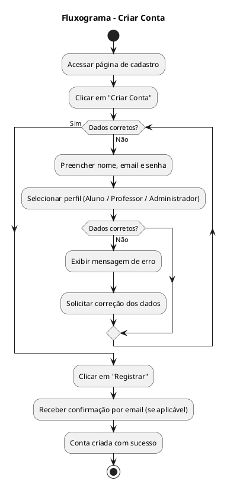
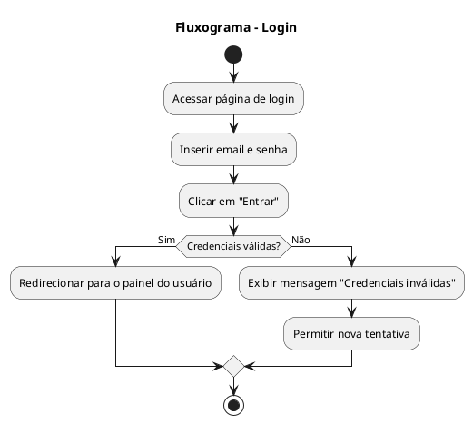
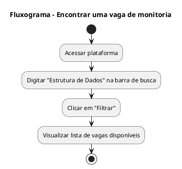
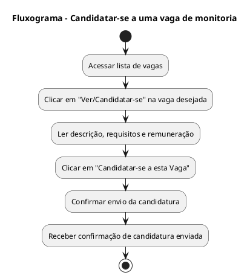

# Análise de Tarefas

## 0. Introduction
Este documento detalha a **Análise Hierárquica de Tarefas (Hierarchical Task Analysis - HTA)** para a plataforma Monitor CASA.  
O objetivo é decompor os objetivos gerais dos usuários em tarefas e ações específicas, servindo como um guia para o design da interface e garantindo que todas as funcionalidades necessárias sejam contempladas para uma experiência de usuário intuitiva e eficiente.

---

## 1. Personas

Para guiar o desenvolvimento, definimos seis personas principais que representam os grupos de usuários da plataforma.

### Aluno: Lucas
- **Perfil**: Estudante 
- **Idade**: 20
- **Curso**: Engenharia da Computação
- **Período**: 4º
- **CR**: 9.7
- **Objetivos**: 
    - Encontrar todas as vagas de monitoria em um só lugar. 
    - Entender claramente os pré-requisitos e o CR mínimo.
    - Acompanhar o status da sua candidatura (recebida, em análise, aprovada).
- **Frustações**: 
    - Fica sabendo das vagas por amigos quando o prazo já está acabando.
    - Não sabe se o professor sequer recebeu seu e-mail de candidatura.
    - Sente que o processo é "quem indica".

### Aluno: Mariana
- **Perfil**: Estudante 
- **Idade**: 21
- **Curso**: Engenharia de Produção
- **Período**: 6º
- **CR**: 8.7
- **Objetivos**: 
    - Conseguir uma bolsa de monitoria para complementar sua renda. 
    - Encontrar vagas que se encaixem em sua grade horária apertada.
    - Ter clareza sobre os prazos de inscrição, seleção e, principalmente, de pagamento.
- **Frustações**: 
    - Processos de seleção que demoram semanas para dar um retorno.
    - Falta de informação centralizada sobre o valor da bolsa e as datas de pagamento.
    - Professores que não respondem e deixam os candidatos "no vácuo".

### Aluno: Pedro
- **Perfil**: Estudante 
- **Idade**: 19
- **Curso**: Ciência da Computação
- **Período**: 2º
- **CR**: 7.5
- **Objetivos**: 
    - Aprofundar seu conhecimento em uma matéria que ele gosta.
    - Ganhar confiança e provar para si mesmo e para os outros sua capacidade.
    - Encontrar vagas onde outros fatores além do CR sejam valorizados (ex: uma pequena prova ou entrevista).
- **Frustações**: 
    - Ser descartado automaticamente de processos seletivos por causa do seu CR.
    - Achar que as vagas são sempre preenchidas pelos "gênios" da turma.
    - Não ter um espaço para destacar suas outras qualidades (proatividade, boa didática, etc.).

### Professora: Daniele
- **Perfil**: Professor 
- **Idade**: 45
- **Curso**: Coordenadora do Ciclo Básico de Engenharia
- **Objetivos**:
    - Publicar uma vaga de forma rápida e simples.
    - Visualizar todos os candidatos em uma única tela, já ordenados por CR. 
    - Acessar o histórico escolar e contato dos alunos facilmente.
- **Frustações**:
    - Sua caixa de e-mails fica lotada com candidaturas com títulos diferentes.
    - Precisa pedir o histórico de cada aluno individualmente.
    - Gasta mais de uma semana para conseguir selecionar alguém.

### Professor: Tiago
- **Perfil**: Professor  
- **Idade**: 57
- **Cargo**: Coordenadora do Ciclo Básico de Engenharia
- **Objetivos**:
    - Encontrar um aluno empolgado e curioso para colaborar na disciplina.
    - Otimizar a seleção para focar em candidatos com perfil de "mentor"/"auxiliar do professor", não apenas "melhor nota".
    - Criar um relacionamento de mentoria que possa evoluir para uma iniciação científica.
- **Frustações**:
    - Sistemas que só permitem filtrar por CR, escondendo candidatos com outras qualidades.
    - A burocracia da universidade para formalizar a contratação do monitor.
    - Não conseguir "vender" sua vaga de monitoria de forma atrativa para os melhores alunos.

### Administrador: Sandra
- **Perfil**: Administrador CASA  
- **Idade**: 65
- **Cargo**: Chefe da Secretaria Acadêmica de Graduação.
- **Objetivos**:
    - Ter uma visão geral de todas as monitorias ativas em tempo real.
    - Exportar relatórios (ex: vagas por departamento, número de candidatos, etc.).
    - Gerenciar permissões de usuários (cadastrar novos professores, resetar senhas, etc.).
    - Garantir que as regras do programa de monitoria (ex: CR mínimo geral, limite de horas) estão sendo cumpridas.
- **Frustações**:
    - Ter que cobrar informações de cada professor por e-mail para montar relatórios.
    - Processos manuais que são suscetíveis a erros e fraudes.
    - Não ter como auditar ou rastrear as decisões de seleção dos professores.
    - Perder muito tempo com tarefas operacionais, como resolver problemas de acesso dos usuários.

---

## 2. Metas, Tarefas e Ações

A estrutura da análise se baseia em três níveis de granularidade:

- **Meta (Goal)**: O objetivo final do usuário, o que ele deseja alcançar.  
  *Exemplo: "Conseguir uma vaga de monitoria."*  

- **Tarefa (Task)**: As atividades e passos principais que o usuário precisa realizar para atingir sua meta.  
  *Exemplo: "Procurar por vagas de monitoria disponíveis."*  

- **Ação (Action)**: As interações específicas e diretas com a interface para completar uma tarefa.  
  *Exemplo: "Clicar no campo de busca" ou "Digitar 'Cálculo I'".*  

---

## 3. Análise de Tarefas por Persona

Antes de detalhar as tarefas específicas de cada persona, existem ações universais que todos os usuários devem realizar para acessar a plataforma.

### 3.0 Tarefas Universais

#### Tarefa 0.1: Criar uma conta no sistema
- **Meta**: Registrar-se na plataforma para poder utilizar suas funcionalidades.  

| Passo | Descrição | Ações |
|-------|-----------|-------|
| 1 | Acessar página de cadastro | 1.1 Clicar em "Criar Conta" na tela inicial |
| 2 | Preencher informações pessoais | 2.1 Digitar nome completo, email e senha 2.2 Selecionar perfil (Aluno, Professor ou Administrador) |
| 3 | Confirmar cadastro | 3.1 Clicar em "Registrar"  |

---

#### Tarefa 0.2: Realizar login no sistema
- **Meta**: Acessar a plataforma com credenciais válidas.  

| Passo | Descrição | Ações |
|-------|-----------|-------|
| 1 | Acessar página de login | 1.1 Inserir email e senha |
| 2 | Autenticar usuário | 2.1 Clicar em "Entrar" 2.2 Aguardar validação das credenciais |
| 3 | Entrar no sistema | 3.1 Redirecionamento para o painel correspondente ao perfil |

---

### 3.1 Aluno: Name

#### Tarefa 1: Encontrar uma vaga de monitoria
- **Meta**: Localizar vagas de monitoria relevantes na sua área de interesse.  

| Passo | Descrição | Ações |
|-------|-----------|-------|
| 1 | Buscar por vagas relevantes | 1.1 Digitar "Estrutura de Dados" na barra de busca 1.2 Clicar em "Filtrar" |
| 2 | Verificar resultados da busca | 2.1 Visualizar lista de vagas disponíveis |

---

#### Tarefa 2: Candidatar-se a uma vaga de monitoria
- **Meta**: Enviar candidatura para uma vaga de interesse.  

| Passo | Descrição | Ações |
|-------|-----------|-------|
| 1 | Selecionar vaga desejada | 1.1 Clicar em "Ver/Candidatar-se" |
| 2 | Analisar detalhes da vaga | 2.1 Ler a descrição, requisitos e remuneração |
| 3 | Enviar candidatura | 3.1 Clicar em "Candidatar-se a esta Vaga" 3.2 Confirmar envio |

---

#### Tarefa 3: Consultar o status de uma candidatura enviada
- **Meta**: Saber se foi selecionado para uma vaga ou se o processo ainda está em andamento.  

| Passo | Descrição | Ações |
|-------|-----------|-------|
| 1 | Entrar na conta | 1.1 Acessar sistema com credenciais já cadastradas |
| 2 | Acessar área de candidaturas | 2.1 Clicar em "Minhas Candidaturas" |
| 3 | Verificar status da vaga | 3.1 Localizar vaga "Estrutura de Dados" 3.2 Ler status exibido ("Em análise", "Aprovado", "Não selecionado") |

---

### 3.2 Professora: Name

#### Tarefa 1: Criar e publicar uma nova vaga de monitoria
- **Meta**: Encontrar um monitor qualificado para sua disciplina.  

| Passo | Descrição | Ações |
|-------|-----------|-------|
| 1 | Acessar formulário de criação | 1.1 Realizar login 1.2 Clicar em "[+ Criar Nova Vaga]" |
| 2 | Preencher informações da vaga | 2.1 Digitar título, descrição e requisitos 2.2 Inserir valor da bolsa |
| 3 | Publicar a vaga | 3.1 Revisar informações 3.2 Clicar em "Publicar Vaga" |

#### Tarefa 2: Avaliar candidatos inscritos
- **Meta**: Escolher o melhor candidato para a vaga de monitoria.  

| Passo | Descrição | Ações |
|-------|-----------|-------|
| 1 | Acessar lista de candidatos | 1.1 Localizar vaga "Estrutura de Dados" 1.2 Clicar em "Ver Candidatos" |
| 2 | Analisar perfil do candidato | 2.1 Clicar no nome "Carlos Mendes" 2.2 Visualizar informações do aluno |
| 3 | Selecionar candidato | 3.1 Voltar à lista 3.2 Clicar em "Selecionar" |

---

### 3.3 Administrador: Name

#### Tarefa 1: Obter resumo da atividade do programa
- **Meta**: Entender o status geral do programa para relatórios.  

| Passo | Descrição | Ações |
|-------|-----------|-------|
| 1 | Acessar painel administrativo | 1.1 Realizar login como administrador |
| 2 | Interpretar dados | 2.1 Analisar cartões de "Resumo Rápido" 2.2 Observar gráficos de atividade |

#### Tarefa 2: Desativar perfil de um estudante
- **Meta**: Manter a base de usuários atualizada e segura.  

| Passo | Descrição | Ações |
|-------|-----------|-------|
| 1 | Acessar gerenciamento de usuários | 1.1 Realizar login 1.2 Clicar em "Gerenciar Usuários" |
| 2 | Localizar estudante | 2.1 Clicar na aba "Estudantes" 2.2 Buscar nome do estudante |
| 3 | Alterar status | 3.1 Clicar em "Ver/Editar" 3.2 Alterar de "Ativo" para "Inativo" 3.3 Clicar em "Salvar Alterações" |

---
