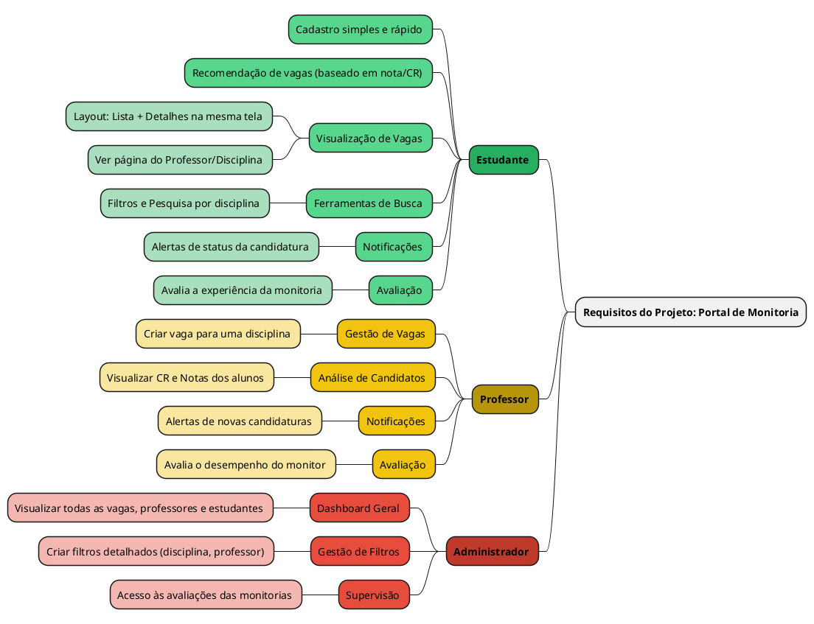

 
## Introdução
 

Mapa mental consiste em criar resumos cheios de símbolos, cores, setas e frases de efeito com o objetivo de organizar o conteúdo e facilitar associações entre as informações destacadas. Esse material é muito indicado para pessoas que têm facilidade de aprender de forma visual.

 
## Metodologia
 

Criamos um mapa mental depois da pesquisa (v.1) e um mapa mental depois do brainstorm (v.2).

 
## Mapa mental - Geral.
 
## Versão 1.0
 
### Mapa mental 1
 

 
 
## Conclusão
 

O mapa mental é uma ficha de estudos que ajuda a dar uma visão geral do tema, e ajuda a fixar os pontos mais importantes sobre o app.

