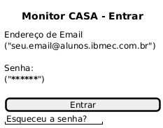
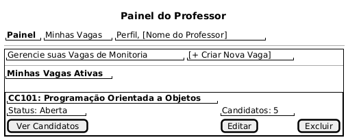
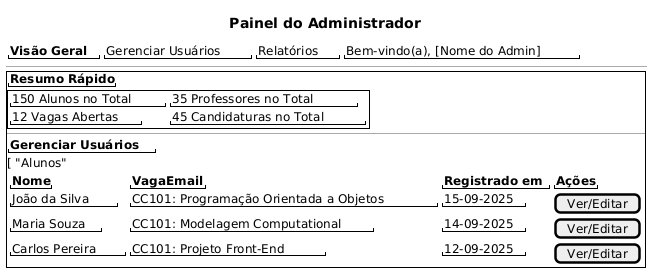
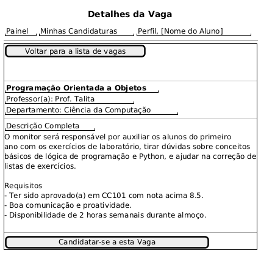

## Introdução

<p align = "justify">
Este documento apresenta os mockups de baixa fidelidade (low-fidelity) para as telas principais da plataforma Monitor CASA.  O objetivo é definir e visualizar a estrutura fundamental e os fluxos de navegação para os diferentes perfis de usuário antes de avançar para o design visual detalhado.
</p>

## Metodologia

<p align = "justify">
Para a criação destes diagramas de interface, foi utilizada a ferramenta online PlantText, que renderiza a sintaxe Salt do PlantUML. Este método foi escolhido para visualizar rapidamente a estrutura, o fluxo de navegação e as funcionalidades essenciais de cada página, focando na usabilidade antes da fase de design visual detalhado. 
</p>

## Protótipo de baixa fidelidade

### Versão 1.0

### Tela Login
A página de entrada para todos os usuários.



```
@startsalt
{
  title "Monitor CASA - Entrar"
  Endereço de Email
  ("seu.email@alunos.ibmec.com.br")
  .
  Senha:
  ("******************************")
  .
  [          Entrar           ]
  
  "Esqueceu a senha?"
}
@endsalt

```

### Tela Painel do Aluno
A visão principal para o aluno encontrar e se candidatar às vagas de monitoria.


```
@startsalt
{
  title "Painel do Aluno"
  {
    "<b>Painel</b>" | "Minhas Candidaturas" | "Perfil, Nome do Aluno]"
  }
  ---
  {+
    "Encontre sua Próxima Oportunidade!"
    {
      ("Buscar por matéria, professor...")
      [Filtrar]
    }
    --
    "<b>Vagas Disponíveis (2)</b>"
    .
    {#
      {|
        "<b>CC101: Modelagem Computational</b>"
        "Professor(a): Prof. Danielle"
        "Descrição: Ajudar alunos do primeiro ano com laboratórios..."
        [Ver/Candidatar-se]
      |}
    }
    .
    {#
      {|
        "<b>FIS250: Programação Orientada a Objetos</b>"
        "Professor(a): Prof. Talita"
        "Descrição: Conduzir sessões de revisão semanais...          "
        [Ver/Candidatar-se]
      |}
    }
  }
}
@endsalt    
```

### Tela Painel do Professor
A tela para professores gerenciarem suas vagas e visualizarem os candidatos.



```
@startsalt
{
  title "Painel do Professor"
  {
    "<b>Painel</b>" | "Minhas Vagas" | "Perfil, [Nome do Professor]"
  }
  ---
  {+
    {
      "Gerencie suas Vagas de Monitoria" | "[+ Criar Nova Vaga]"
    }
    --
    "<b>Minhas Vagas Ativas</b>"
    .
    {#
      {|
        "<b>CC101: Programação Orientada a Objetos</b>"
        "Status: Aberta" | "Candidatos: 5" 
        [Ver Candidatos] | [Editar] | [Excluir]
      |}
    }
  }
}
@endsalt
```

### Tela Painel do Admin
A visão geral para administradores, com estatísticas e ferramentas de gerenciamento de usuários.


```
@startsalt
{
  title "Painel do Administrador"
  {
    "<b>Visão Geral</b>" | "Gerenciar Usuários" | "Relatórios" | "Bem-vindo(a), [Nome do Admin]"
  }
  ---
  {+
    "<b>Resumo Rápido</b>"
    {#
      {|
        "150 Alunos no Total" | "35 Professores no Total"
        "12 Vagas Abertas" | "45 Candidaturas no Total"
      |}
    }
    --
    "<b>Gerenciar Usuários</b>"
    [ "Alunos"
    {
      {|
        "<b>Nome</b>" | "<b>VagaEmail</b>" | "<b>Registrado em</b>" | "<b>Ações</b>"
        "João da Silva" | "CC101: Programação Orientada a Objetos" | "15-09-2025" | [Ver/Editar]
        "Maria Souza" | "CC101: Modelagem Computational" | "14-09-2025" | [Ver/Editar]
        "Carlos Pereira"| "CC101: Projeto Front-End" | "12-09-2025" | [Ver/Editar]
      |}
    }
  }
}
@endsalt
```


### Tela de Detalhes da Vaga
Esta página fornece todas as informações sobre uma vaga específica e permite que o aluno inicie o processo de candidatura.



```
@startsalt
{
  title "Detalhes da Vaga"
  {
    "Painel" | "Minhas Candidaturas" | "Perfil, [Nome do Aluno]"
  }
  ---
  {+
    [Voltar para a lista de vagas]
    .
    .
    --
    "<b>Programação Orientada a Objetos</b>"
    "Professor(a): Prof. Talita"
    "Departamento: Ciência da Computação"
    
    --
    "Descrição Completa"
    O monitor será responsável por auxiliar os alunos do primeiro
    ano com os exercícios de laboratório, tirar dúvidas sobre conceitos
    básicos de lógica de programação e Python, e ajudar na correção de 
    listas de exercícios.
    .
    Requisitos
    
      - Ter sido aprovado(a) em CC101 com nota acima 8.5.
      - Boa comunicação e proatividade.
      - Disponibilidade de 2 horas semanais durante almoço.
    .
    --
    [         Candidatar-se a esta Vaga       ]
  }
}
@endsalt
```


## Conclusão

<p align = "justify">
A série de mockups de baixa fidelidade apresentada oferece uma base estrutural sólida para o desenvolvimento da plataforma Monitor CASA. Ao focar na disposição dos elementos, nas funcionalidades-chave e nos fluxos de interação para os perfis de aluno, professor e administrador, garantimos que os requisitos fundamentais do sistema foram mapeados de forma clara e lógica.
</p>

## Referências
> Ferramenta PlantText. Disponível em https://www.planttext.com/
